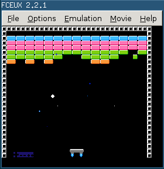

# Spaceout: Breakout *in space* for the NES

This is a silly little NES game written in C and compiled with
[cc65](https://github.com/cc65/cc65).  It was initially based on the NES example
programs in [jmk/cc65-nes-examples](https://github.com/jmk/cc65-nes-examples).

## TODO

* Title screen
* Mutliple lives
* Score
* Music
* Sound effects
* Explosions

## Things of note

* I didn't like the idea of linking my charset/tilesets in as a binary file.
  I removed the `incbin` statement from crt0.s and replaced the CHR sets with
  the definitions in charset.c and tileset.c.

* Programming for the NES is hard.  Among the hints I've found:

  * Avoid using local variables.

  * Avoid multiply and divide.

  * Store your data in `unsigned char` whenever possible.

  * Use a collection of arrays rather than an array of structs.
